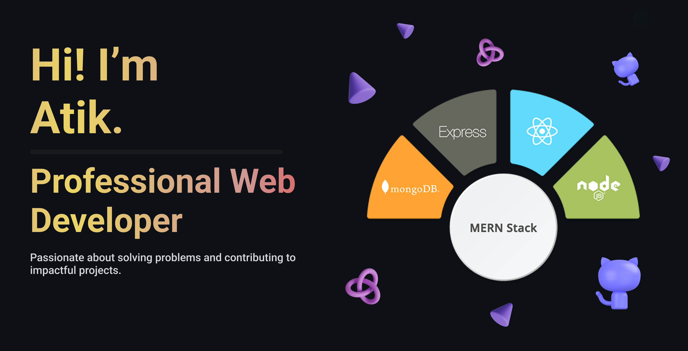

<h1 align="center">Atikur Rahman</h1>

<h2 align="center">About Me</h2>
👋 Hi, I'm Atikur Rahman!   
🎓 Final-year CSE undergrad | 💻 Web Developer | 🚀 Problem Solver    

I'm passionate about learning and building web applications. I enjoy solving challenging problems, exploring new technologies, and continuously improving my skills.   

🔹 Full-stack web development  
🔹 Competitive programming & problem-solving  
🔹 Interested in bioinformatics & machine learning   

Let's connect and collaborate! 🚀  

<h2 align="center">🚀 Current Activities </h2>

- 🔍 Exploring **Next.js**, **Django REST** framework and advanced React patterns  
- 🌍 Working as a **Freelance Web Developer**
- 🏗️ Building a **Bangla Sign Language(BSL) interpreter app** (Capstone Project)  
- 🧬 Learning about **Machine Learning** and its applications  
<!-- - 🏆 Solving **DSA** problems and improving problem-solving skills  -->

<h2 align="center">Skills</h2>
 

  
  
  
  
  
  
  
  
  
  
  
  
  
  
  

 

<h2 align="center">STATS</h2>

  
  
  
  
  

<h2 align="center">Contact Me</h2>
 

  
  
  
  

 
